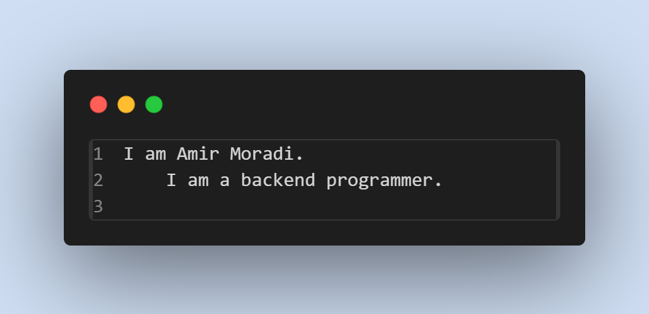

 

_________________________________________________________________________________________________________________________________________________

 

# 💫 About Me:
I am a novice programmer... 👨🏻‍💻.I am currently learning Django and network security I am very interested in Django programming language ⚡️.I hope I had the necessary energy to learn other programming languages

  

## 🌐 Socials:

# 💻 Teachings:

